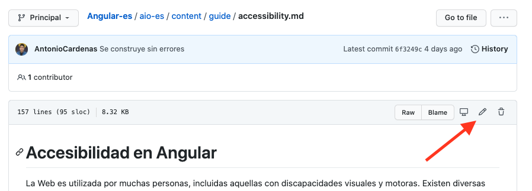

# Contribution to angular-es

## File organization

-`origin`: manage the `angular/angular` repository as a submodule
-`aio-x`: manage the translation source file `xxx.en.md`, the translation file` .md` and other files to overwrite `origin`.

### aio directory structure

Basically the Markdown file in the `content` directory is translated.
If necessary, edit the source code of the application as well.

https://github.com/angular/angular/tree/master/aio

```
origin/year /
├── README.md
├── content# A document resource file written in Markdown or HTML. Mainly translate files here
│ ├── cli document resource #CLI
│ ├── examples# Source code of the sample code
│ ├── guide# Guide document resource
│ ├── images# Image in documentation
│ ├── marketing# Resources to present Angular, such as links and event information
│ ├── home# Introduction Tutorial resources
│ ├── navigation.json# Site navigation management files
│ └── tutorial# Tour de los Heroes Tutorial resources
├── application source code src# angular.io
...

```

## Translation process flow

Before you start translating, make sure no one is trying to translate the same file.
[Translation check] (https://github.com/angular/angular-en/labels/type%3A%20Translation%20Checkout) If you look at the tag topic, you can see the area where we are currently working on the translation.
If you want to make a new translation, [Create problem] (https://github.com/angular/angular-es/issues/new/choose) and fill in the information according to Templates.

## Minor fixes

For minor fixes to already translated documentation, create a pull request with the `Edit` function on GitHub.


## Add translation

To translate an untranslated document again, copy the source file as `xxx.en.md` from` origin` to `aio-x` and create a translation for that source as` xxx.md`. ..
Submit a pull request to add the two files.

### Local preparation

#### 1. Cloning the repository

```
$ git clone git@github.com:angular-es/AngularComunities.git

```

#### 2. Source repository sync

This repository uses a submodule to integrate with the source repository.

```
$ git submodule sync
$ git submodule update --init

```

#### 3. First compilation

When the compilation is complete, the documentation site will be displayed in the `.tmp/aio/dist` directory.
You can check the created site by setting up a development server with your favorite tool.

```
$ ./build.sh

```
#### 3.2x
If you use windows use this command in powershell it can be executed from windows server 2008 > , it has been tested on windows 8 and 10.

```
$./build-win.ps1 or .\build.sh
```

**Note**
-If you have problems with windows, check if your system is compatible with robocopy & Get-Content.
-The construction time is very long, so please wait while you make coffee.
-On MacOS, the operating system file descriptor can be used during the build process.
  In that case, you need to increase the maximum number check this:
https://github.com/meteor/meteor/issues/8057#issuecomment-261011063

```
$ echo kern.maxfiles = 65536 | sudo tee -a /etc/sysctl.conf
$ echo kern.maxfilesperproc = 65536 | sudo tee -a /etc/sysctl.conf
$ sudo sysctl -w kern.maxfiles = 65536
$ sudo sysctl -w kern.maxfilesperproc = 65536
$ ulimit -n 65536

```

#### Working with differential builds

After doing a local compilation once, you can rewrite the file directly to the `.tmp/aio` directory and work seamlessly with a differential compilation.
As long as the `yarn serve-and-sync` command is running, it can automatically rebuild when there are changes to the files in` .tmp/aio`.
However, the work in the `.tmp` directory is not managed by Git, so be sure to reflect it in the` aio-x` directory after the job.

```
$ cd .tmp/aio
$ yarn serve-and-sync
# starts the sever on localhost:4200 

```

### Creating a translation request

Before you start translating, make sure no one is trying to translate the same file.
[Translation Check](https://github.com/yourname/reponame/labels/type%3A%20Translation%20Checkout) If you look at the tag topic, you can see the area where we are currently working on the translation.
If you want to make a new translation, [Create a issue](https://github.com/angular/angular/issues/new/choose) and fill in the information according to Templates.

### Create a translation pull request

Push the changes to the repository where angular/angular-es forked and send a pull request to the source of the fork.
Pull requests will be reviewed and merged if all is ok

## Translation guidelines

Follow the guidelines below for Spanish translation.

### Save the source text as a `.en.md` file

To manage the difference from the original text after updating the source, save the original text at the time of translation as a `xxx.en.md` file.
For a new translation, copy the English file `xxx.md` into the file` xxx.en.md` and edit the source file of the copy `xxx.md`.

### Align line break position with original text

If possible, make sure the original and translated lines have the same number of lines, and cooperate to make it easy to check for differences when updating.

### Follow textlint

Basic unification of notation fluctuations can be automatically corrected using textlint.
If textlint encounters an error, it is caught in CI and the pull request cannot be merged.

### Keep original nuances

Since the documentation is a technical document, maintaining readability, keep the nuances of the original text as much as possible and keep translations to a minimum.

Until you get used to it, it is recommended to proceed by correcting specific Angular terms based on machine translations like Google Translate.

### About 'Hanging Links Found': Add Anchor

When you compile, you may get the following error:

```
warn: Dangling Links Found in "guide/deployment.json":
 -guide/browser-support#polyfills
warn: Dangling Links Found in "guide/deprecations.json":
 -guide/releases#deprecation-practices,
 -guide/component-styles#deprecated-deep - y-ng-deep
warn: Dangling Links Found in "guide/glossary.json":
 -guide/workspace-config # project-tool-configuration-options,
 -guide/workspace-config # project-tool-configuration-options
warn: Dangling Links Found in "api/common/NgForOf.json":
 -guide/template-syntax # template-reference-variables - var-
error: Error: 6 unmatched links
```

This error is a relative link in the documentation warning that the link cannot be found.
In the first example above, although the `guide/implementation` is linked to` guide/browser-support#polyfills`, the `guide/browser-support` page says `#polyfills`. Warning that the holder does not exist.

This error often occurs when you translate a header that begins with `#`.
You must add an anchor in the translation to resolve the link reference. Add a form directive `{@a xxxxxx}` to the translated header as follows.

```md

## Polyfill {@a polyfills}

```